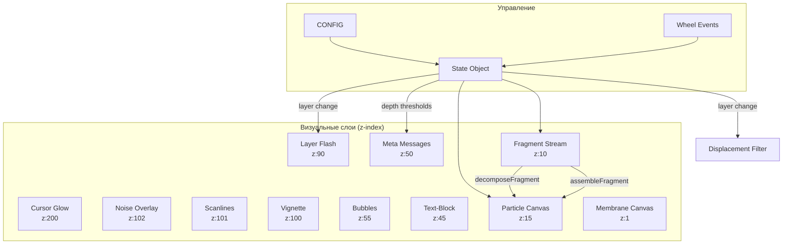

# KLYAP v16 — Техническая документация

> **Версия:** 16.0 | **Файл:** `prototypes/klyap-v16/index.html` (1456 строк)  
> **Стек:** Vanilla JS + Canvas API + CSS Animations + SVG Filters

---

## 📐 ГРАФ ЗАВИСИМОСТЕЙ



---

## 🔧 МОДУЛЬ → КОД

### 1. MEMBRANE
| Аспект | Значение |
|--------|----------|
| **Технология** | Canvas 2D API (`getContext('2d')`) |
| **DOM** | `<canvas id="membrane-canvas">` |
| **Строки** | 655–754 |
| **Конфиг** | `MEMBRANE_CONFIG` (L655–663) |
| **Функции** | `initBlobs()`, `drawMembrane()`, `resizeMembrane()` |
| **Рендер** | `requestAnimationFrame(drawMembrane)` — бесконечный цикл |

**Алгоритм blob:**
```
for each blob:
  1. drift position += driftX/Y
  2. breathFactor = sin(time * speed + phase)
  3. cursor influence = distance-based pull
  4. draw noisy polygon with radialGradient
```

---

### 2. FRAGMENTS
| Аспект | Значение |
|--------|----------|
| **Технология** | DOM manipulation + CSS Animations |
| **DOM** | `<div id="stream">` → `.fragment` children |
| **Строки** | 889–956 (spawn), 756–786 (layer system) |
| **Конфиг** | `CONFIG.phases`, `CONFIG.fragmentLifetime`, `LAYER_MAP` |
| **CSS анимация** | `@keyframes fragment-emerge` (L215–238) |

**Жизненный цикл:**
```js
spawnFragment()
  → createElement('.fragment.layer-{name}')
  → set CSS vars (--drift-x, --drift-y, --anim-duration)
  → appendChild(img)
  → setTimeout(decomposeFragment, lifetime)
```

**Layer System:**
```js
LAYER_MAP = { intimate: [...], mirror: [...], ... }  // L759–766
LAYER_THRESHOLDS = [{ depth: 0, layer: 'noise' }, ...]  // L767–775
getCurrentLayer()  // L854–861
```

---

### 3. PARTICLES
| Аспект | Значение |
|--------|----------|
| **Технология** | Canvas 2D API + Class-based physics |
| **DOM** | `<canvas id="particle-canvas">` |
| **Строки** | 1080–1303 |
| **Класс** | `class Particle` (L1105–1196) |
| **Лимит** | `MAX_PARTICLES = 300` |

**Физика частицы:**
```js
update() {
  vx += wind.x * 0.1
  vy += gravity
  vx *= viscosity  // 0.90–0.97
  vy *= viscosity
  x += vx; y += vy
  alpha -= decay
}
```

**Интерфейсы:**
| Функция | Вызывается из | Что делает |
|---------|---------------|------------|
| `decomposeFragment(el)` | setTimeout в spawnFragment | Создаёт 15–25 частиц из центра элемента |
| `assembleFragment(el)` | setTimeout (30% шанс) | Создаёт 20–35 частиц, летящих к элементу |
| `triggerWindSweep()` | layer change | Устанавливает wind.x/y |

---

### 4. ATMOSPHERIC
| Компонент | Технология | DOM | Строки CSS |
|-----------|------------|-----|------------|
| Vignette | CSS radial-gradient + animation | `#vignette` | 38–69 |
| Scanlines | CSS repeating-linear-gradient | `#scanlines` | 71–95 |
| Noise | SVG inline (feTurbulence) + CSS | `#noise` | 97–118 |

**Анимации:**
```css
@keyframes vignetteBreathe { /* 10s cycle, scale 1→0.88→1 */ }
@keyframes scanlineFlicker { /* 0.2s, opacity 0.3→0.45 */ }
@keyframes noisePulse { /* 5s, opacity 0.03→0.08 */ }
```

---

### 5. DISPLACEMENT
| Аспект | Значение |
|--------|----------|
| **Технология** | SVG Filter (`feDisplacementMap` + `feTurbulence`) |
| **DOM** | `<svg><filter id="displacement-filter">` |
| **Строки** | 579–587 (SVG), 996–1018 (JS) |
| **Применение** | `#stream.displacement-active { filter: url(#displacement-filter) }` |

**Алгоритм:**
```js
triggerDisplacement(fromLayer, toLayer) {
  scale = DISPLACEMENT_INTENSITY[key]  // 30–70
  animate: scale *= DISPLACEMENT_DECAY (0.92) each frame
  until scale < 2 → remove filter
}
```

---

### 6. BUBBLES
| Аспект | Значение |
|--------|----------|
| **Технология** | DOM + CSS Animations + Event Listeners |
| **DOM** | `.bubble-container` → `.provocation-bubble` × 5 |
| **Строки** | 599–611 (HTML), 457–571 (CSS), 1336–1449 (JS) |
| **Конфиг** | `BUBBLE_CONFIG` (L1339–1345) |

**CSS анимации:**
```css
@keyframes blobMorph { /* 8s, border-radius morphing */ }
@keyframes bubbleBreath { /* 4s, scale + shadow pulse */ }
```

**Триггеры появления:**
| Триггер | Условие | Строки |
|---------|---------|--------|
| Auto-show | 5s, затем каждые 10s | 1373–1378 |
| Idle | mouseMove idle > 5s | 1427–1435 |
| Deep idle | каждые 8s бездействия | 1440–1443 |

---

### 7. TEXT-BLOCK
| Аспект | Значение |
|--------|----------|
| **Технология** | DOM + CSS Transitions |
| **DOM** | `<div class="text-block" id="text-block">` |
| **Строки** | 597 (HTML), 396–442 (CSS), 1309–1334 (JS) |
| **Фразы** | `TEXT_PHRASES[]` (L1311–1314) |

**Тайминги:**
```js
setTimeout(showTextBlock, 3000)      // первое появление
setInterval(rotateTextBlock, 15000)  // ротация
```

---

## 🔄 ИНТЕРФЕЙСЫ МЕЖДУ МОДУЛЯМИ

```
┌─────────────┐     layer change      ┌──────────────┐
│  FRAGMENTS  │ ─────────────────────▶│ DISPLACEMENT │
└─────────────┘                       └──────────────┘
       │                                     │
       │ decomposeFragment()                 │
       ▼                                     ▼
┌─────────────┐     triggerWindSweep() ┌─────────────┐
│  PARTICLES  │ ◀──────────────────────│ LAYER FLASH │
└─────────────┘                        └─────────────┘
       ▲
       │ assembleFragment() (30% chance)
       │
┌─────────────┐
│  FRAGMENTS  │
└─────────────┘
```

---

## 📊 STATE OBJECT

```js
const state = {
  fragmentsSpawned: 0,    // счётчик всех спавнов
  activeFragments: 0,     // текущие на экране
  depth: 0,               // 0–100, = spawned × 1.2
  scrollDelta: 0,         // накопленный scroll
  exhaustionLevel: 0,     // 0–1, замедляет spawn
  lastScrollTime: 0,      // для decay
  isVoid: false,          // пауза активна
  lastMetaIndex: -1,      // последнее мета-сообщение
  startTime: Date.now(),
  currentLayer: 'noise',
  previousLayer: null
};
```

**Формула depth:** `depth = min(100, fragmentsSpawned × 1.2)`

---

## 🎚️ КЛЮЧЕВЫЕ ТОЧКИ НАСТРОЙКИ

| Что менять | Переменная | Строка | Тип |
|------------|------------|--------|-----|
| Скорость spawn | `CONFIG.phases.*.interval` | 622–626 | ms |
| Время жизни фрагмента | `CONFIG.fragmentLifetime` | 629 | seconds |
| Макс фрагментов | `CONFIG.maxActiveFragments` | 619 | count |
| Частота burst | `CONFIG.burstChance` | 632 | 0–1 |
| Частота void | `CONFIG.voidChance` | 636 | 0–1 |
| Ротация text-block | `setInterval(..., 30000)` | 1334 | ms |
| Auto-show bubbles | `setTimeout/setInterval` | 1373–1378 | ms |
| Membrane opacity | `MEMBRANE_CONFIG.baseOpacity` | 658 | 0–1 |

---

## ➕ ДОБАВЛЕНИЕ НОВОГО СЛОЯ

Чек-лист для добавления нового контентного слоя (например, `organic`):

| # | Что сделать | Где | Строки |
|---|-------------|-----|--------|
| 1 | Создать директорию с PNG | `assets/klyap-v16/fragments/{layer}/` | — |
| 2 | Добавить маппинг фрагментов | `LAYER_MAP[layer] = [...]` | 759–766 |
| 3 | Добавить depth-порог | `LAYER_THRESHOLDS.push({...})` | 767–775 |
| 4 | Добавить CSS flash-эффект | `#layer-flash.{layer}` | 342–364 |
| 5 | Добавить CSS фильтр (опц.) | `.fragment.layer-{layer} img` | ~185 |

**Пример:**
```js
// В LAYER_MAP (L759):
organic: ['001', '002', '003', '004', '005'],

// В LAYER_THRESHOLDS (L767):
{ depth: 35, layer: 'organic' },
```

```css
/* CSS flash (L342+): */
#layer-flash.organic {
    background: radial-gradient(circle, rgba(80, 180, 80, 0.4), transparent 70%);
}
```

---

## 🏷️ ВЕРСИОНИРОВАНИЕ

| Что фиксировать жёстко | Что может меняться |
|------------------------|---------------------|
| Названия модулей | Тайминги в CONFIG |
| Структура LAYER_MAP | Количество фрагментов в слоях |
| Граф зависимостей | CSS-значения анимаций |
| Интерфейсы функций | Текст фраз и баблов |

> [!WARNING]
> При изменении таймингов проверяйте **inline-комментарии** в коде — они могут устареть.
> Например: `// rotate every 15s` может не соответствовать актуальному значению.

---

*Документация v16.1 | 2026-01-15*
