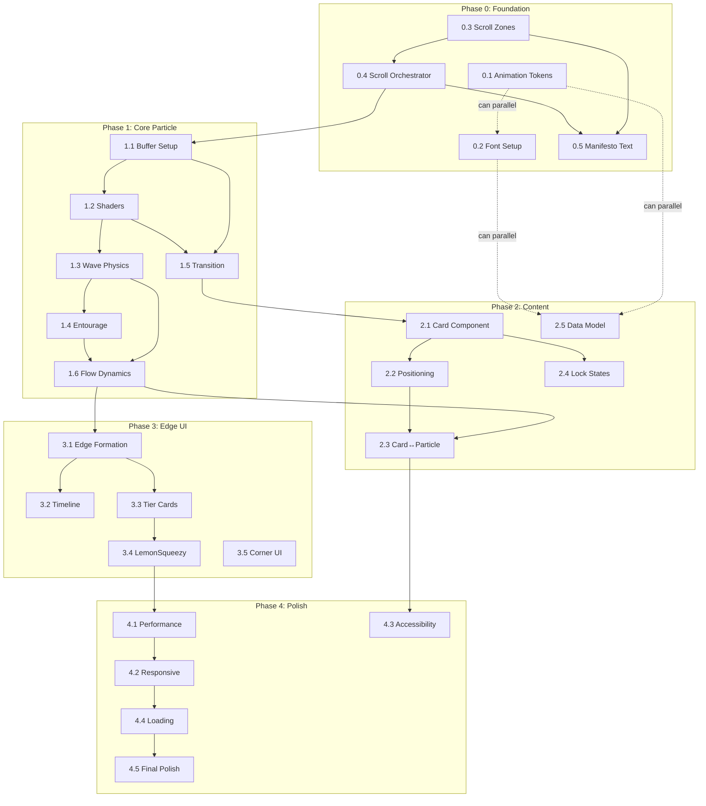

# Post‑Void Experience — Implementation Plan (V2)

Этот документ перемещён в каноничное место: `docs/plans/2026-01-27-post-void-experience.md`.

Причина: план должен жить рядом с остальными планами репозитория, но оставаться применимым к прототипу `prototypes/crowdfund-void/`.

Открывай и реализуй: `docs/plans/2026-01-27-post-void-experience.md`.

### Task 0.3: Scroll Zone Architecture
**Duration**: 1-2 часа

**Description**: Расширить страницу для 6 keyframes post-void.

**Current**: `#void-zone` at 150vh
**Target**: 
```
#void-zone: 150vh (scroll 0-100% = void experience)
#post-void-zone: 600vh (scroll 0-100% = post-void experience)
```

**Scroll mapping**:
| Post-void scroll % | Keyframe | Content |
|--------------------|----------|---------|
| 0% | 1 | "О. Ты дошёл.", manifesto starts |
| 20% | 2 | Manifesto reads, content appears |
| 40% | 3 | Words fly away with blur, edge hints |
| 60% | 4 | Edges 50%, manifesto 50% dissolved |
| 80% | 5 | Full edges, timeline + tiers |
| 100% | 6 | Final state, tier CTA prominent |

**Files**:
- `[MODIFY]` `index.html` — add `#post-void-zone` section
- `[MODIFY]` `void.js` — add post-void scroll tracking

**Acceptance Criteria**:
- [ ] Page scrolls smoothly through both zones
- [ ] Void zone unchanged (tunnel works)
- [ ] Post-void zone has correct height

**Dependencies**: None

---

### Task 0.4: Scroll Orchestrator
**Duration**: 2-3 часа

**Description**: Центральная система управления состоянием всех элементов по scroll keyframes.

**Responsibilities**:
- Track post-void scroll progress (0-100%)
- Emit keyframe events to all systems
- Manage element visibility/opacity
- Coordinate manifesto, particles, cards, edges

**Implementation approach**:
```javascript
// ScrollOrchestrator.js
class ScrollOrchestrator {
    constructor() {
        this.listeners = [];
        this.keyframes = [0, 0.2, 0.4, 0.6, 0.8, 1.0];
        this.currentKeyframe = 0;
    }
    
    onScroll(progress) {
        // Determine current keyframe
        const kf = this.keyframes.findIndex((k, i) => 
            progress >= k && progress < (this.keyframes[i+1] || 1.0)
        );
        
        // Emit to all listeners
        this.listeners.forEach(fn => fn({
            progress,
            keyframe: kf,
            phase: this.getPhase(progress)
        }));
    }
    
    subscribe(callback) {
        this.listeners.push(callback);
    }
}
```

**Files**:
- `[NEW]` [ScrollOrchestrator.js](file:///Users/admin/projects/personal-site/prototypes/crowdfund-void/ScrollOrchestrator.js)
- `[MODIFY]` `void.js` — integrate orchestrator

**Acceptance Criteria**:
- [ ] All systems receive scroll updates
- [ ] Keyframe transitions reliable
- [ ] Console log shows current state

**Dependencies**: Task 0.3

---

### Task 0.5: Manifesto Text System
**Duration**: 3-4 часа

**Description**: Реализовать текст манифеста с motion blur и вылетом при скролле.

**Manifesto content** (from [soul_manifest.md](file:///Users/admin/.gemini/antigravity/knowledge/personal_digital_garden/artifacts/philosophy/soul_manifest.md)):
```
1. Личность — это малый бизнес
2. Соло — это честно
3. AI — это суперкостюм
4. Смелость — единственный билет
5. Сияние, не прилипание
```

**Behavior**:
- Scroll 0%: "О. Ты дошёл." appears (already in void.js)
- Scroll 0-20%: Manifesto lines fade in sequentially
- Scroll 20-40%: All visible, readable
- Scroll 40-60%: Lines fly away with motion blur
- Scroll 60%+: Manifesto gone

**Motion blur effect**:
```glsl
// In fragment shader: radial blur based on velocity
vec2 blurDir = normalize(velocity);
float blurAmount = length(velocity) * 0.1;
// Sample multiple points along blur direction
```

**Files**:
- `[NEW]` [ManifestoText.js](file:///Users/admin/projects/personal-site/prototypes/crowdfund-void/ManifestoText.js)
- `[NEW]` [shaders/motionBlur.frag](file:///Users/admin/projects/personal-site/prototypes/crowdfund-void/shaders/motionBlur.frag)
- `[MODIFY]` `void.js` — integrate manifesto

**Acceptance Criteria**:
- [ ] All 5 manifesto lines render via Troika
- [ ] Sequential fade-in on scroll
- [ ] Motion blur during fly-away
- [ ] Smooth timing, feels "incantatory"

**Dependencies**: Task 0.3, 0.4

---

## Phase 1: Core Particle System

### Overview
Создать GPU-accelerated particle system с 100k частицами, который активируется после void transition.

### Task 1.1: Particle Buffer Setup
**Duration**: 3-4 часа

**Description**: Создать `ParticleSystem.js` с THREE.Points для GPU rendering.

> ⚠️ **Changed from InstancedMesh to THREE.Points** — 5-10x lighter for dots/glows.

**Implementation**:
```javascript
// ParticleSystem.js
class ParticleSwarm {
    constructor(count = 100000) {
        // BufferGeometry for positions
        this.geometry = new THREE.BufferGeometry();
        this.positions = new Float32Array(count * 3);
        this.velocities = new Float32Array(count * 3);
        this.colors = new Float32Array(count * 3);
        
        // Initialize positions randomly
        for (let i = 0; i < count; i++) {
            this.positions[i * 3] = (Math.random() - 0.5) * 2;
            this.positions[i * 3 + 1] = (Math.random() - 0.5) * 2;
            this.positions[i * 3 + 2] = (Math.random() - 0.5) * 2;
        }
        
        this.geometry.setAttribute('position', 
            new THREE.BufferAttribute(this.positions, 3));
        this.geometry.setAttribute('color',
            new THREE.BufferAttribute(this.colors, 3));
        
        // Custom ShaderMaterial for glow + size
        this.material = new THREE.ShaderMaterial({
            vertexShader: particleVert,
            fragmentShader: particleFrag,
            transparent: true,
            blending: THREE.AdditiveBlending,
            depthWrite: false,
        });
        
        this.points = new THREE.Points(this.geometry, this.material);
    }
}
```

**Files to create/modify**:
- `[NEW]` [ParticleSystem.js](file:///Users/admin/projects/personal-site/prototypes/crowdfund-void/ParticleSystem.js)
- `[MODIFY]` [void.js](file:///Users/admin/projects/personal-site/prototypes/crowdfund-void/void.js) — import and initialize

**Acceptance Criteria**:
- [ ] 100k particles rendering at 60fps on M1 Mac
- [ ] Particles distributed in 3D space around center
- [ ] FPS counter visible in dev mode

**Dependencies**: Task 0.3, 0.4

---

### Task 1.2: Particle Shaders
**Duration**: 2-3 часа

**Description**: Custom ShaderMaterial для частиц с color interpolation, glow, и size variation.

**Implementation details**:
- Vertex shader: position + size attenuation by depth
- Fragment shader: soft radial gradient (glow effect)
- Color uniforms: Electric Magenta → Acid Cyan → Deep Violet

**Color palette** (from Design Brief):
| Role | Hex |
|------|-----|
| Primary | `#ff00ff` |
| Secondary | `#00ffff` |
| Tertiary | `#8b00ff` |
| Gold sparks | `#ffd700` |

**Files**:
- `[NEW]` [shaders/particle.vert](file:///Users/admin/projects/personal-site/prototypes/crowdfund-void/shaders/particle.vert)
- `[NEW]` [shaders/particle.frag](file:///Users/admin/projects/personal-site/prototypes/crowdfund-void/shaders/particle.frag)

**Acceptance Criteria**:
- [ ] Particles have soft glow, not hard circles
- [ ] Color varies by position/time
- [ ] Rare gold sparks (1% of particles)

**Dependencies**: Task 1.1

---

### Task 1.3: Cursor Physics — Wave Emission
**Duration**: 3-4 часа

**Description**: Implement "камень в воду" — cursor creates expanding ring waves.

**Physics model** (from Design Brief):
- Radius of influence: ~200px
- Force falloff: exponential (1/r²)
- Wave speed: 0.5 units/second
- Wave decay: fade over 2 seconds

**Implementation approach**:
```javascript
// Each frame, emit wave from cursor position
// Store in ring buffer of active waves
const waves = []; // { origin: vec2, time: number, strength: number }

function emitWave(cursorPos) {
    waves.push({ origin: cursorPos.clone(), time: performance.now(), strength: 1 });
    if (waves.length > 10) waves.shift();
}

// In particle update shader:
// for each wave: calculate distance, apply force if within radius
```

**Files**:
- `[MODIFY]` `ParticleSystem.js` — add wave uniforms
- `[MODIFY]` `shaders/particle.vert` — wave displacement

**Acceptance Criteria**:
- [ ] Moving cursor creates visible ripples in swarm
- [ ] Ripples expand outward and fade
- [ ] Performance: no FPS drop with continuous movement

**Dependencies**: Task 1.1, 1.2

---

### Task 1.4: Cursor Physics — Entourage Formation
**Duration**: 3-4 часа

**Description**: Ближайшие частицы следуют за курсором как "свита".

**Physics model** (from Design Brief):
- Radius: ~50px for selection
- Follow distance: 30-80px behind cursor
- Max entourage: 50-100 particles
- On stop: slowly dissipate back to flow

**Implementation approach**:
- Track N closest particles using spatial hash or GPU compute
- Apply spring force toward cursor position
- On cursor idle > 1s, reduce entourage spring strength

**Files**:
- `[MODIFY]` `ParticleSystem.js` — entourage logic
- `[MODIFY]` `shaders/particle.vert` — conditional spring force

**Acceptance Criteria**:
- [ ] ~50 particles visibly follow cursor
- [ ] Particles trail behind, not pile on cursor
- [ ] On pause, entourage disperses over 2s

**Dependencies**: Task 1.3

---

### Task 1.5: Void → Swarm Transition
**Duration**: 2-3 часа

**Description**: Seamless transition от shader background к particle swarm при scroll=100%.

**Transition sequence**:
1. scroll 0-99%: void.js shader visible, particles hidden
2. scroll 100%: shader fades, particles spawn from center
3. Particles "explode" outward, then settle into flows

**Implementation approach**:
- Use `state.scrollProgress` already in void.js
- At threshold (0.98), begin particle spawn animation
- Crossfade: shader opacity 1→0, particle opacity 0→1
- Duration: 800ms

**Files**:
- `[MODIFY]` `void.js` — add particle system init, crossfade logic
- `[MODIFY]` `shaders/particle.frag` — global opacity uniform

**Acceptance Criteria**:
- [ ] No visual "pop" during transition
- [ ] Particles appear to emerge from void center
- [ ] Shader fully hidden after transition complete

**Dependencies**: Task 1.1, 1.2

---

### Task 1.6: Particle Flow Dynamics
**Duration**: 2-3 часа

**Description**: Particles form organic flowing streams, not random noise.

**Flow model**:
- 3-5 major flow "rivers" rotating around space
- Curl noise for organic movement
- Particles have individual variation (±20% speed)

**Implementation**:
```glsl
// Curl noise for flow direction
vec2 curl = vec2(
    noise(pos.xy + time * 0.1) - noise(pos.xy - vec2(0.01, 0.0)),
    noise(pos.xy + time * 0.1) - noise(pos.xy - vec2(0.0, 0.01))
);
velocity += curl * flowStrength;
```

**Files**:
- `[MODIFY]` `shaders/particle.vert` — flow dynamics
- `[NEW]` [shaders/noise.glsl](file:///Users/admin/projects/personal-site/prototypes/crowdfund-void/shaders/noise.glsl) — shared noise functions

**Acceptance Criteria**:
- [ ] Visible streams/rivers of particles
- [ ] Organic, not mechanical movement
- [ ] Flows avoid cursor (negative space)

**Dependencies**: Task 1.3, 1.4

---

## Phase 2: Content Cards + States

### Overview
Добавить floating content cards (40-50 шт.) с parallax depth и hover interactions.

---

### Task 2.1: Content Card Component
**Duration**: 2-3 часа

**Description**: Создать HTML/CSS компонент для content cards с 5 размерами.

**Sizing system** (from Design Brief):
| Size | Aspect | Desktop px |
|------|--------|------------|
| XL | 16:9 | 480×270 |
| L | 4:3 | 320×240 |
| M | 1:1 | 200×200 |
| S | 3:4 | 150×200 |
| Text | Auto | 280×auto |

**Card states**:
- Default: subtle glow
- Hover: lift + glow intensify
- Locked: blur + lock icon
- Active: expanded/playing

**Files**:
- `[NEW]` [components/ContentCard.js](file:///Users/admin/projects/personal-site/prototypes/crowdfund-void/components/ContentCard.js)
- `[NEW]` [components/ContentCard.css](file:///Users/admin/projects/personal-site/prototypes/crowdfund-void/components/ContentCard.css)

**Acceptance Criteria**:
- [ ] 5 size variants working
- [ ] All 4 states styled
- [ ] Glass morphism effect

**Dependencies**: Task 1.5 (need base experience running)

---

### Task 2.2: Card Positioning System
**Duration**: 2-3 часа

**Description**: Распределить карточки в 3D пространстве с parallax.

**Layout rules**:
- Cards distributed on different z-planes
- Closer cards: larger, sharper
- Farther cards: smaller, blurred
- No overlapping at rest

**Implementation**:
```javascript
// Assign each card a z-depth (0.1 to 1.0)
// On scroll/cursor movement, apply parallax translation
const parallaxFactor = card.zDepth * 0.3;
card.style.transform = `translate3d(
    ${cursorX * parallaxFactor}px, 
    ${cursorY * parallaxFactor}px, 
    ${card.zDepth * 100}px
)`;
```

**Files**:
- `[NEW]` [CardManager.js](file:///Users/admin/projects/personal-site/prototypes/crowdfund-void/CardManager.js)
- `[MODIFY]` `void.js` — integrate card manager

**Acceptance Criteria**:
- [ ] Cards at multiple z-depths
- [ ] Parallax responds to cursor
- [ ] Distant cards appropriately blurred

**Dependencies**: Task 2.1

---

### Task 2.3: Card ↔ Particle Interaction
**Duration**: 2-3 часа

**Description**: Particles flow around cards (card = "dead zone").

**Behavior**:
- Particles avoid card bounding boxes
- Cards create local "current" redirecting flow
- On card hover: nearby particles intensify color

**Files**:
- `[MODIFY]` `ParticleSystem.js` — obstacle avoidance
- `[MODIFY]` `CardManager.js` — emit card positions to shader

**Acceptance Criteria**:
- [ ] Particles clearly avoid cards
- [ ] Flow looks natural around obstacles
- [ ] Hover creates visible particle reaction

**Dependencies**: Task 1.6, 2.2

---

### Task 2.4: Locked Content States
**Duration**: 2-3 часа

**Description**: Implement 3 lock strategies from Design Brief.

**Strategies**:
| Type | Strategy | Effect |
|------|----------|--------|
| Photo/Video | Джобс | 2s preview → fade → "Дальше?" |
| Text/Blog | Моргенштерн | Visible but "Это для тех, кто уже внутри." |
| Project/Demo | Учёный | Normal, hover reveals "Ты уже догадываешься..." |

**Files**:
- `[MODIFY]` `ContentCard.js` — add lock modes
- `[MODIFY]` `ContentCard.css` — locked states

**Acceptance Criteria**:
- [ ] Each strategy visually distinct
- [ ] Copy matches Design Brief
- [ ] Lock icon/overlay smooth

**Dependencies**: Task 2.1

---

### Task 2.5: Content Data Model
**Duration**: 1-2 часа

**Description**: Создать JSON schema и sample data для content.

**Content types** (from Brief):
| Type | MVP Count |
|------|-----------|
| Blog/Thought | 5-8 |
| Photo | 15-20 |
| Video | 5-8 |
| Project/Demo | 3-5 |
| Artifact | 5-10 |

**Files**:
- `[NEW]` [data/content.json](file:///Users/admin/projects/personal-site/prototypes/crowdfund-void/data/content.json)
- `[NEW]` [data/schema.md](file:///Users/admin/projects/personal-site/prototypes/crowdfund-void/data/schema.md)

**Acceptance Criteria**:
- [ ] Schema covers all content types
- [ ] 5-10 sample items per type
- [ ] Placeholder images/videos ready

**Dependencies**: None (can parallel with 2.1-2.4)

---

## Phase 3: Edge UI + Tier Integration

### Overview
Боковые панели UI, формирующиеся из частиц при scroll 40-80%.

---

### Task 3.1: Edge Particle Formation
**Duration**: 3-4 часа

**Description**: Particles migrate to edges at scroll thresholds.

**Formation timeline** (from Design Brief):
| Scroll % | State |
|----------|-------|
| 40% | Particles start drifting toward edges |
| 60% | Semi-transparent edge structure |
| 80% | Solid edges, some particles still orbiting |
| 100% | Full UI visible |

**Implementation**:
- Add edge attractor forces to particle shader
- Attractor strength scales with scroll progress
- Edge positions: left strip (timeline), right strip (tiers)

**Files**:
- `[MODIFY]` `ParticleSystem.js` — edge attractors
- `[MODIFY]` `shaders/particle.vert` — attractor forces

**Acceptance Criteria**:
- [ ] Smooth particle migration visible
- [ ] Edge shapes emerge organically
- [ ] No abrupt snap to position

**Dependencies**: Task 1.6

---

### Task 3.2: Timeline UI Component (Left Edge)
**Duration**: 2-3 часа

**Description**: Вертикальный timeline на левой грани.

**Contents**:
- Depth indicator ("depth: 847m")
- Project milestones
- Handwritten annotations (Caveat font)

**Files**:
- `[NEW]` [components/Timeline.js](file:///Users/admin/projects/personal-site/prototypes/crowdfund-void/components/Timeline.js)
- `[NEW]` [components/Timeline.css](file:///Users/admin/projects/personal-site/prototypes/crowdfund-void/components/Timeline.css)

**Acceptance Criteria**:
- [ ] Timeline visible at scroll 80%+
- [ ] Depth indicator animates on scroll
- [ ] Handwritten style for annotations

**Dependencies**: Task 3.1

---

### Task 3.3: Tier Cards UI (Right Edge)
**Duration**: 2-3 часа

**Description**: Tier cards на правой грани.

**Tiers** (from Design Brief):
| Tier | Name | Price |
|------|------|-------|
| 0 | Наблюдатель | Free |
| 1 | Спутник | $5/mo |
| 2 | Voyager | $15/mo |
| 3 | Голос | $50/mo |

**States**: Neutral → Hover (reveal details) → Selected

**Files**:
- `[NEW]` [components/TierCard.js](file:///Users/admin/projects/personal-site/prototypes/crowdfund-void/components/TierCard.js)
- `[NEW]` [components/TierCard.css](file:///Users/admin/projects/personal-site/prototypes/crowdfund-void/components/TierCard.css)

**Acceptance Criteria**:
- [ ] 4 tier cards visible
- [ ] Hover reveals benefits
- [ ] Glass/glow aesthetic matches Design Brief

**Dependencies**: Task 3.1

---

### Task 3.4: LemonSqueezy Integration
**Duration**: 3-4 часа

**Description**: Connect tier buttons to LemonSqueezy checkout.

**Integration points**:
- Embed LemonSqueezy.js
- Create checkout overlays for each tier
- Handle success/cancel callbacks

**Files**:
- `[NEW]` [payments/lemon.js](file:///Users/admin/projects/personal-site/prototypes/crowdfund-void/payments/lemon.js)
- `[MODIFY]` `TierCard.js` — checkout button handlers
- `[MODIFY]` `index.html` — LemonSqueezy script

**Acceptance Criteria**:
- [ ] Clicking tier opens checkout
- [ ] Success updates user state
- [ ] Cancel returns to experience

**Dependencies**: Task 3.3

---

### Task 3.5: Corner UI Elements
**Duration**: 1-2 часа

**Description**: Fixed corner elements: logo, CTA, connect.

**Layout**:
- Top-left: "humanji" logo
- Top-right: "Join the Swarm" CTA
- Bottom-right: "connect?" (handwritten)

**Files**:
- `[NEW]` [components/CornerUI.js](file:///Users/admin/projects/personal-site/prototypes/crowdfund-void/components/CornerUI.js)
- `[NEW]` [components/CornerUI.css](file:///Users/admin/projects/personal-site/prototypes/crowdfund-void/components/CornerUI.css)

**Acceptance Criteria**:
- [ ] All corners populated
- [ ] Elements visible at scroll 0% (corners-only mode)
- [ ] "connect?" in Caveat/handwritten font

**Dependencies**: None (can parallel)

---

## Phase 4: Polish + Performance

### Overview
Optimization, accessibility, responsive, and final touches.

---

### Task 4.1: Performance Profiling
**Duration**: 2-3 часа

**Description**: Profile and optimize for 60fps.

**Targets** (from Design Brief):
- Desktop (good GPU): 100k particles, 60fps
- Desktop (average): 50k particles, 60fps
- Tablet: 25k particles
- Mobile: 10k particles
- Weak device: 5k or static

**Tools**: Chrome DevTools Performance, Three.js Stats

**Files**:
- `[MODIFY]` `ParticleSystem.js` — dynamic particle count
- `[NEW]` [utils/deviceDetection.js](file:///Users/admin/projects/personal-site/prototypes/crowdfund-void/utils/deviceDetection.js)

**Acceptance Criteria**:
- [ ] FPS stays >55 on target devices
- [ ] Graceful degradation works
- [ ] No memory leaks over 5min session

**Dependencies**: Phase 1-3 complete

---

### Task 4.2: Responsive Breakpoints
**Duration**: 2-3 часа

**Description**: Implement responsive behavior.

**Breakpoints** (from Design Brief):
| Breakpoint | Changes |
|------------|---------|
| Mobile (<768px) | Reduced particles, corners instead of edges, touch interactions |
| Tablet (768-1024px) | Medium particles, partial edges |
| Desktop (>1024px) | Full experience |

**Files**:
- `[MODIFY]` `styles.css` — media queries
- `[MODIFY]` `ParticleSystem.js` — responsive particle count
- `[MODIFY]` `CardManager.js` — responsive positioning

**Acceptance Criteria**:
- [ ] No horizontal scroll on mobile
- [ ] Content cards stack gracefully
- [ ] Touch interactions work

**Dependencies**: Task 4.1

---

### Task 4.3: Accessibility
**Duration**: 2-3 часа

**Description**: Meet WCAG AA for text, keyboard nav, reduced motion.

**Requirements** (from Design Brief):
- `prefers-reduced-motion`: disable/simplify particles
- Keyboard navigation for all interactive elements
- Screen reader: semantic HTML under visual layer
- Text contrast: WCAG AA on dark backgrounds

**Files**:
- `[MODIFY]` `styles.css` — reduced motion, focus states
- `[MODIFY]` `ParticleSystem.js` — respect prefers-reduced-motion
- `[MODIFY]` `index.html` — ARIA roles

**Acceptance Criteria**:
- [ ] Reduced motion disables particle animation
- [ ] All cards focusable via keyboard
- [ ] Contrast ratio >4.5:1 for body text

**Dependencies**: Phase 2 complete

---

### Task 4.4: Loading Experience
**Duration**: 1-2 часа

**Description**: Optimize initial load and create loading state.

**Targets** (from Design Brief):
- First paint: <1.5s
- Interactive: <3s

**Implementation**:
- Lazy load heavy assets (videos, images)
- Show void shader during particle init
- Progressive particle spawn

**Files**:
- `[MODIFY]` `void.js` — progressive loading
- `[MODIFY]` `index.html` — preload critical fonts

**Acceptance Criteria**:
- [ ] First paint <1.5s on 3G
- [ ] Loading spinner smooth
- [ ] No layout shift during load

**Dependencies**: All phases

---

### Task 4.5: Final Polish
**Duration**: 2-3 часа

**Description**: Animation timing, easing, micro-interactions.

**Polish items**:
- Custom cubic-bezier for all transitions
- Particle trails: 100-200ms decay
- Stagger patterns (wave-based from cursor)
- Gold spark probability tuning

**Files**:
- `[MODIFY]` All component CSS — timing functions
- `[MODIFY]` `ParticleSystem.js` — trail decay, spark logic

**Acceptance Criteria**:
- [ ] Animations feel "organic, not mechanical"
- [ ] No jarring transitions
- [ ] Polish/Punk ratio: 80/20

**Dependencies**: All phases

---

## Technical Stack Summary

| Layer | Technology |
|-------|------------|
| Rendering | Three.js (WebGL), THREE.Points |
| Particles | Custom GLSL shaders, GPU compute for physics |
| Text | Troika-three-text with motion blur shaders |
| Animation | ScrollOrchestrator (custom), requestAnimationFrame |
| Fonts | JetBrains Mono (TTF), Caveat (Google Fonts) |
| Styling | CSS Variables + custom properties |
| Payments | LemonSqueezy |
| Build | Vanilla JS/ES Modules (importmaps) |

---

## File Structure (Target)

```
crowdfund-void/
├── index.html
├── styles.css
├── void.js                    ← Main entry, shader background
├── ScrollOrchestrator.js      ← [NEW] Keyframe state manager
├── ManifestoText.js           ← [NEW] Manifesto with motion blur
├── ParticleSystem.js          ← [NEW] GPU particle swarm
├── CardManager.js             ← [NEW] Content card positioning
├── shaders/
│   ├── particle.vert          ← [NEW]
│   ├── particle.frag          ← [NEW]
│   ├── motionBlur.frag        ← [NEW] Text blur effect
│   └── noise.glsl             ← [NEW] Shared noise
├── components/
│   ├── ContentCard.js         ← [NEW]
│   ├── ContentCard.css        ← [NEW]
│   ├── Timeline.js            ← [NEW]
│   ├── Timeline.css           ← [NEW]
│   ├── TierCard.js            ← [NEW]
│   ├── TierCard.css           ← [NEW]
│   ├── CornerUI.js            ← [NEW]
│   └── CornerUI.css           ← [NEW]
├── payments/
│   └── lemon.js               ← [NEW]
├── utils/
│   └── deviceDetection.js     ← [NEW]
├── assets/
│   └── fonts/
│       └── README.md          ← [NEW] Font documentation
├── data/
│   ├── content.json           ← [NEW]
│   └── schema.md              ← [NEW]
└── docs/
    └── post_void_implementation_plan.md  ← This file
```

---

## Risk Assessment

### 🔴 High Risk: Particle System Performance

**Risk**: 100k particles may not hit 60fps on mid-range devices.

**Likelihood**: Medium-High

**Impact**: Core experience degraded

**Mitigation strategies**:
1. **Early benchmarking** (Task 1.1): Test with 100k before adding physics
2. **GPU compute fallback**: Consider THREE.GPUComputationRenderer for physics
3. **Aggressive degradation**: Detect low FPS dynamically, reduce count
4. **LOD system**: Fewer particles in distance

**Contingency**: If 60fps impossible at 50k, pivot to 25k with higher visual density per particle.

---

### 🟠 Medium Risk: Void → Swarm Transition

**Risk**: Jarring visual discontinuity between shader and particles.

**Likelihood**: Medium

**Impact**: Breaks the "emergence" metaphor

**Mitigation**:
1. **Crossfade** both visual layers simultaneously
2. **Particle spawn pattern**: outward explosion mimics shader's final state
3. **Color matching**: ensure particle colors match shader palette at transition

---

### 🟠 Medium Risk: Mobile Performance

**Risk**: Even 10k particles may lag on low-end iPhones.

**Likelihood**: Medium

**Impact**: Large user segment excluded

**Mitigation**:
1. **Static fallback**: Pre-rendered particle image as worst case
2. **Canvas 2D fallback**: Simpler rendering if WebGL struggles
3. **Touch-only mode**: Disable continuous cursor tracking on mobile

---

### 🟡 Low Risk: LemonSqueezy Integration

**Risk**: Payment flow breaks or provider changes API.

**Likelihood**: Low

**Impact**: Monetization blocked

**Mitigation**:
1. **Abstract payment layer**: Wrap LemonSqueezy calls
2. **Test mode first**: Full testing before live
3. **Fallback CTA**: Email collection if payments fail

---

### 🟡 Low Risk: Content Card Z-fighting

**Risk**: Parallax cards overlap awkwardly.

**Likelihood**: Low

**Impact**: Visual clutter

**Mitigation**:
1. **Explicit z-order**: No two cards at same depth
2. **Collision detection**: Offset overlapping cards at runtime
3. **Limited card count per z-layer**

---

## Dependency Graph



---

## Estimation Summary

| Phase | Tasks | Total Hours |
|-------|-------|-------------|
| Phase 0 | 5 | 8-13 |
| Phase 1 | 6 | 18-26 |
| Phase 2 | 5 | 12-18 |
| Phase 3 | 5 | 11-16 |
| Phase 4 | 5 | 15-20 |
| **Total** | **26** | **64-93** |

**Calendar estimate**: 
- Full-time focus: 2-3 weeks
- Part-time: 4-5 weeks

---

## MVP Definition (End of Phase 0+1)

At end of Phase 0 + Phase 1, you will have:
- ✅ Scroll zones configured (750vh total)
- ✅ Manifesto text with motion blur fly-away
- ✅ Scroll orchestrator managing all states
- ✅ Void tunnel → particle swarm transition
- ✅ 100k GPU particles with cursor physics
- ✅ Wave emission + entourage following
- ✅ Organic flow dynamics
- ❌ No content cards yet
- ❌ No tiers yet

**This is deployable** as a standalone experience (spectacle + manifesto, без контента).

---

## Next Steps

1. **Approve this plan** — or request changes
2. **Phase 0 start**: Task 0.1 (Animation Tokens) + Task 0.2 (Fonts) + Task 2.5 (Data Model) can run in parallel
3. **After 0.3 (Scroll Zones)**: Phase 1 can begin

---

*Implementation Plan created: 2026-01-28*
*Based on Design Brief v1*
